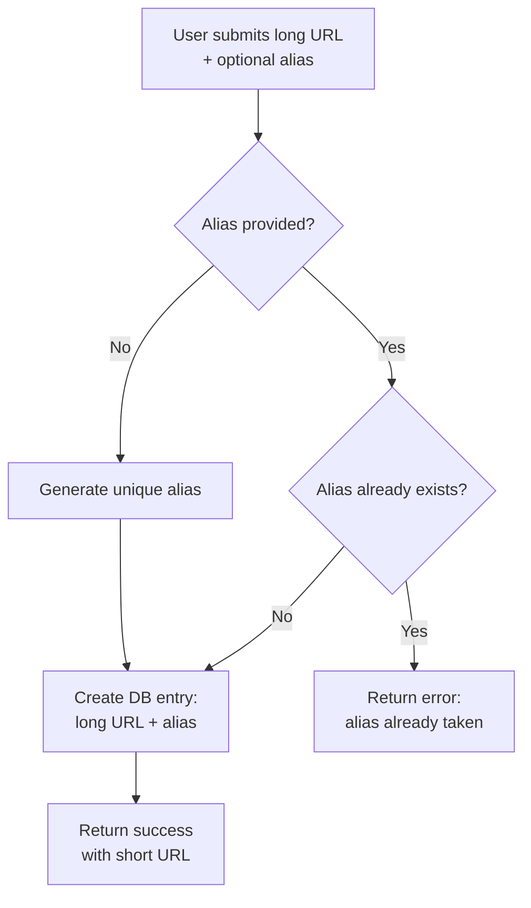
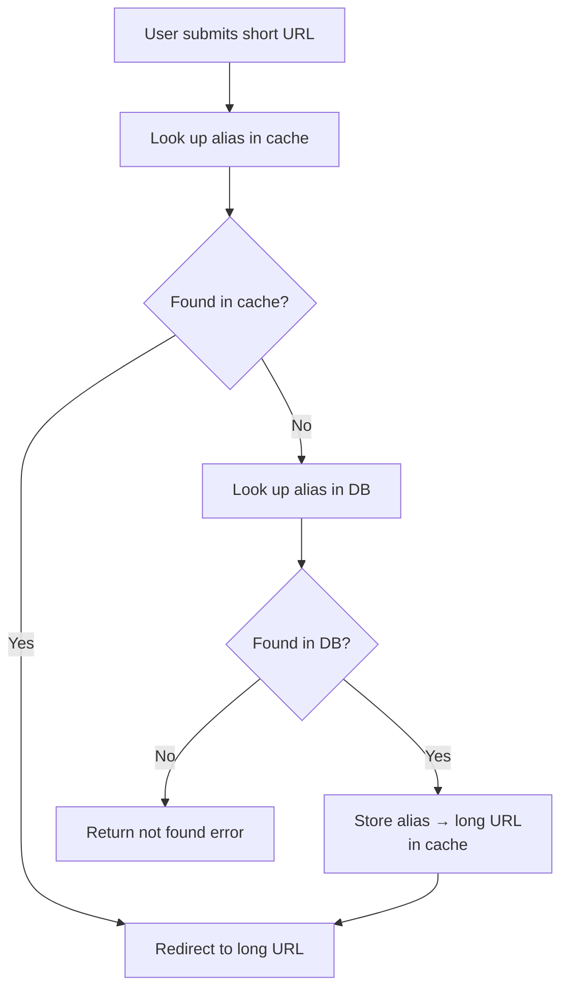
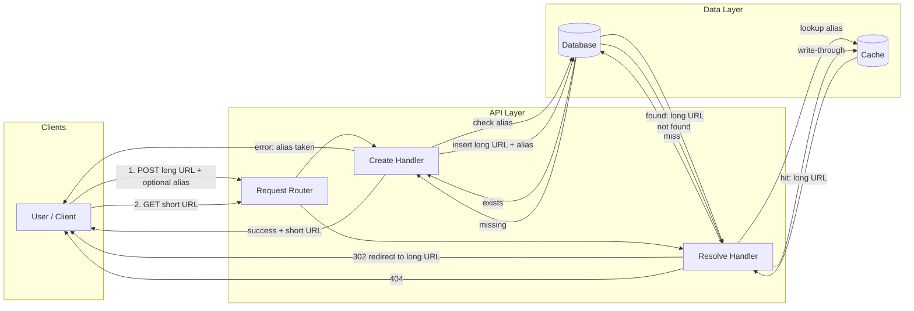

# URL Shortener — Request Flows

## Create

User submits a long URL with an optional alias. If no alias is provided, one is generated. If a provided alias already exists, the request fails; otherwise a DB entry is created.

## Resolve

User submits a short URL. Lookup hits cache first, then DB on miss. On a DB hit, the mapping is written through to cache before redirecting.

## Request lifecycle and data flow

| Path | Steps | Data touched |
|------|--------|----------------|
| **Create** | Request → Alias check → Insert → Response | DB write; no cache |
| **Resolve** | Request → Cache → (DB on miss) → Cache fill → Redirect | Cache read/write; DB read |
